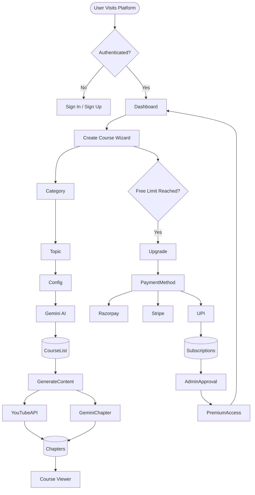

# 🚀 AI Course Generator

An intelligent SaaS-based learning platform that automatically generates complete educational courses using Generative AI. The system creates structured curriculums, detailed chapter content, programming examples, and curated video resources, enabling users to learn any topic through a personalized learning experience.

## 🌐 Live Demo

**Deployment:** https://ai-course-generator-seven-phi.vercel.app

---

# 📖 Overview

AI Course Generator is a full-stack AI-powered learning platform that allows users to generate complete courses in seconds.

Users can:

- Create custom courses on any topic
- Generate AI-powered chapter content
- Learn through structured reading materials
- Watch relevant tutorial videos
- Track generated courses from a personal dashboard
- Upgrade to premium plans for unlimited course generation

The platform combines the power of **Google Gemini AI**, **YouTube Data API**, **Next.js**, **Neon PostgreSQL**, and **Clerk Authentication** to provide an end-to-end automated learning solution.

---

# ✨ Features

## Course Generation

- Multi-step course creation wizard
- Topic-based curriculum generation
- Difficulty level selection
- Course duration customization
- Chapter count configuration
- Multi-language support
- Optional video integration

## AI-Powered Content

- Course outline generation using Gemini AI
- Detailed chapter explanations
- Step-by-step learning guides
- Programming examples and code snippets
- Markdown-based content rendering

## Video Integration

- Automatic YouTube video matching
- Filters out YouTube Shorts
- Displays educational tutorials alongside chapter content

## User Dashboard

- View all generated courses
- Continue learning anytime
- Manage personal course library

## Authentication

- Secure sign-up/sign-in using Clerk
- Protected routes
- User-specific course management

## Subscription System

- Free Tier: Up to 5 course generations
- Premium Tier: Unlimited course generation
- Razorpay integration
- Stripe checkout simulation
- UPI payment support
- Manual subscription approval system

## Admin Portal

- Verify UPI transactions
- Approve premium subscriptions
- Manage membership access
- Monitor payment requests

---

# 🏗️ Technology Stack

## Frontend

- Next.js 16
- React 19
- Tailwind CSS v4
- Radix UI
- React Markdown
- Lucide Icons
- React Icons

## Backend

- Next.js App Router
- Server Actions
- API Routes

## Authentication

- Clerk Authentication

## Database

- Neon PostgreSQL
- Drizzle ORM
- Drizzle Kit

## AI Services

- Google Gemini 2.5 Flash

## External APIs

- YouTube Data API v3
- Razorpay API
- Stripe Checkout

---

# 🗄️ Database Schema

## CourseList

| Column | Type |
|----------|---------|
| id | Serial (PK) |
| courseId | Varchar |
| name | Varchar |
| category | Varchar |
| level | Varchar |
| includeVideo | Varchar |
| courseOutput | JSON |
| createdBy | Varchar |
| username | Varchar |
| userProfileImage | Varchar |
| language | Varchar |

### Purpose
Stores generated course metadata and curriculum structure.

---

## Chapters

| Column | Type |
|----------|---------|
| id | Serial (PK) |
| courseId | Varchar |
| chapterId | Integer |
| content | JSON |
| videoId | Varchar |

### Purpose
Stores detailed AI-generated chapter content and associated YouTube videos.

---

## Subscriptions

| Column | Type |
|----------|---------|
| id | Serial (PK) |
| email | Varchar |
| utr | Varchar |
| amount | Varchar |
| plan | Varchar |
| status | Varchar |
| createdAt | Varchar |

### Purpose
Stores subscription requests and payment verification details.

---

# 🔄 Application Workflow

## Stage 1: User Authentication

1. User visits the platform.
2. Clerk middleware checks authentication.
3. Unauthenticated users are redirected to Sign-In/Sign-Up.
4. Authenticated users access the dashboard.

---

## Stage 2: Course Creation

### Step 1: Category Selection

Examples:

- Programming
- Artificial Intelligence
- Technology
- Business
- Health
- Creative Arts

### Step 2: Topic & Description

Users provide:

- Course Topic
- Short Description

Example:

**Topic:** Python Loops

**Description:** Learn iteration concepts and looping techniques in Python.

### Step 3: Course Configuration

Users select:

- Difficulty Level
- Course Duration
- Number of Chapters
- Language
- Video Inclusion

---

## Stage 3: AI Curriculum Generation

The platform sends a structured prompt to Google Gemini AI.

Generated output includes:

- Course Title
- Learning Objectives
- Chapter Breakdown
- Curriculum Structure

The generated course outline is stored in the `CourseList` table.

---

## Stage 4: Chapter Content Generation

For each chapter:

### YouTube Processing

- Search relevant educational videos
- Exclude YouTube Shorts
- Select medium-length tutorials

### Gemini Processing

Generate:

- Detailed explanations
- Concept breakdowns
- Examples
- Source code snippets
- Learning notes

### Database Storage

Save:

- Chapter content
- Video ID
- Metadata

into the `Chapters` table.

---

## Stage 5: Course Viewer

Users can:

- Read AI-generated content
- Watch embedded tutorial videos
- Navigate chapter-by-chapter
- Learn through structured lessons

---

## Stage 6: Subscription & Premium Access

### Free Plan

- Maximum 5 generated courses

### Premium Plan

Unlimited course generation.

Supported payment methods:

- Razorpay
- Stripe Checkout
- UPI Transfer

### UPI Verification Workflow

1. User transfers payment.
2. User submits UTR number.
3. Request stored as Pending.
4. Admin verifies transaction.
5. Premium access granted.

---

# 📊 Workflow Diagram



---

# 📂 Project Structure

```bash
ai-course-generator/
│
├── app/
│   ├── dashboard/
│   ├── create-course/
│   ├── course/
│   ├── upgrade/
│   ├── admin/
│   └── api/
│
├── components/
│
├── configs/
│   ├── db.js
│   ├── schema.jsx
│   └── dbNormalize.js
│
├── lib/
│
├── public/
│
├── styles/
│
├── drizzle/
│
├── middleware.js
│
├── package.json
│
└── README.md
```

---

# ⚙️ Environment Variables

Create a `.env.local` file:

```env
NEXT_PUBLIC_CLERK_PUBLISHABLE_KEY=
CLERK_SECRET_KEY=

DATABASE_URL=

GEMINI_API_KEY=

YOUTUBE_API_KEY=

NEXT_PUBLIC_RAZORPAY_KEY_ID=
RAZORPAY_SECRET=

STRIPE_SECRET_KEY=
NEXT_PUBLIC_STRIPE_PUBLISHABLE_KEY=
```

---

# 🚀 Installation

### Clone Repository

```bash
git clone https://github.com/yourusername/ai-course-generator.git
```

### Navigate to Project

```bash
cd ai-course-generator
```

### Install Dependencies

```bash
npm install
```

### Push Database Schema

```bash
npm run db:push
```

### Start Development Server

```bash
npm run dev
```

Open:

```bash
http://localhost:3000
```

---

# 🔐 Admin Panel

Admin dashboard route:

```bash
/dashboard/admin
```

Features:

- View pending subscriptions
- Verify UTR numbers
- Approve premium users
- Manage memberships

---

# 🎯 Future Enhancements

- AI Quiz Generator
- Progress Tracking Dashboard
- Course Completion Certificates
- Export Course as PDF
- AI Mentor Chatbot
- Voice-Based Learning Assistant
- Personalized Learning Paths
- Community Discussion Forums

---

# 📸 Screenshots

Add screenshots of:

- Home Page
- Dashboard
- Course Creation Wizard
- Generated Curriculum
- Course Viewer
- Upgrade Page
- Admin Panel

---

# 👨‍💻 Author

**Sithik Ranjan V R**

B.Tech – Artificial Intelligence and Data Science

Passionate about AI, Full-Stack Development, Generative AI Applications, and Educational Technology.

---

# 📜 License

This project is intended for educational, research, and portfolio purposes.

© 2026 AI Course Generator. All Rights Reserved.
